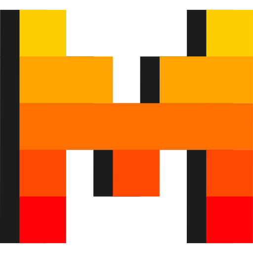

<!-- Bannière de bienvenue -->
<h1 align="center">Salut, moi c'est <strong>Nayeff !</strong> 👋🏼</h1>

Développeur fullstack passionné

---

### 🚀 À propos de moi

Je prépare actuellement un **Master of Science IT & Business – Niv BAC +5 - Ingénierie du web**, à la **Plateforme**.

💡 Curieux, rigoureux et passionné par les Homelabs, l'IA et l'automatisation, je suis constamment à la recherche de **projets stimulants** qui combinent backend robuste, frontend élégant et intelligence artificielle.

> _"Simplicité dans le code, clarté dans l'expérience."_  
> _"Automatiser le banal pour libérer le génial."_

---

### 🧰 Stack technique & outils

#### 💻 Frontend

#### 💾 Backend

#### 🗃️ Base de données

#### ⛃ ORM / ODM

#### 📱 Mobile

#### 👨‍💻 DevOps & CI/CD

#### ✨ Intelligence Artificielle  

Dans mes projets **web** et **mobile**, j'intègre des **APIs d'IA** telles que **Mistral AI**, **ChatGPT**, et **Claude** pour offrir des expériences intelligentes et interactives.  

 

  &nbsp;&nbsp;&nbsp;
  &nbsp;&nbsp;&nbsp;
  &nbsp;&nbsp;&nbsp;
  &nbsp;&nbsp;&nbsp;
  &nbsp;&nbsp;&nbsp;

<table style="border-collapse: collapse; width: 100%; border-spacing: 0;">
  <tr>
    <td style="border: none; padding: 0;">
      
    </td>
    <td style="border: none; padding-left: 8px; vertical-align: middle; line-height: 36px;">
      <strong>Automatisation</strong>
    </td>
  </tr>
</table>

 **n8n** me permet d'automatiser des workflows complexes, en connectant des applications, des services tiers, et des processus métier tout en intégrant l'IA pour rendre ces automatisations encore plus puissantes. 

Voici quelques cas d’utilisation :  
- **Génération de contenu automatisée** via des modèles d'IA  
- **Création d'assistants autonomes** pour les applications  
- **Traitement de données et intégration avec des APIs externes** pour des automatisations avancées  

🧠 + 🤖 = ⚡ Productivité optimisée, tâches répétitives supprimées, et expériences utilisateurs enrichies.

---

### 📌 En ce moment

- 💼 En alternance en tant que développeur fullstack  
- 🎓 Étudiant à **L'École de la Plateforme**  
- 🔍 Je reste à l'écoute pour collaborer sur des projets innovants (SaaS, AI, automatisation…)

---

<!-- Signature -->

Merci pour votre visite 🚀

